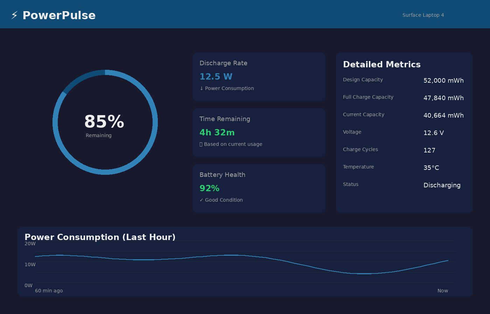

# PowerPulse — Battery Monitor for Windows



PowerPulse is a comprehensive battery monitoring application for Windows laptops, specifically designed for Surface devices but compatible with all Windows laptops. It provides detailed real-time battery information that Windows doesn't show by default.

## ✨ Features

### Core Features
- **🔋 Real-time Battery Monitoring** - Polls battery data every 3 seconds
- **⚡ Accurate Time Remaining** - Uses EMA (Exponential Moving Average) algorithm for stable estimates
- **📊 Battery Health Tracking** - Shows degradation percentage (Full Charge / Design Capacity)
- **🔌 Discharge & Charge Rates** - Displays current power consumption in Watts
- **⚡ Voltage Monitoring** - Shows current battery voltage
- **💪 Multiple Data Sources** - Uses Windows.Devices.Power API with WMI fallback

### Advanced Features
- **📈 Historical Data Tracking** - Tracks power consumption over the last hour
- **📊 Average & Peak Power** - Displays 1-hour average and peak discharge rates
- **🔔 Smart Notifications** - Alerts for low battery (20%), critical battery (10%), and full charge
- **🎨 Beautiful Dark Theme** - Modern, clean UI with color-coded health indicators
- **🪟 System Tray Integration** - Minimize to tray, quick access from notification area
- **🎯 Multi-API Support** - Automatically selects best available battery API
- **🧪 Simulated Battery Mode** - Works on desktops without battery for testing

## 🎯 Key Metrics

PowerPulse displays all the battery information you need:

| Metric | Description |
|--------|-------------|
| **Battery Percentage** | Current charge level (0-100%) |
| **Time Remaining** | Calculated using smoothed discharge rate |
| **Discharge/Charge Rate** | Current power consumption/charging in Watts |
| **Battery Health** | Percentage showing battery degradation |
| **Design Capacity** | Original battery capacity when new |
| **Full Charge Capacity** | Current maximum capacity (degrades over time) |
| **Remaining Capacity** | Current charge in Wh |
| **Voltage** | Current battery voltage |
| **Average Power** | 1-hour average discharge rate |
| **Peak Power** | 1-hour peak discharge rate |

## 🚀 Getting Started

### Prerequisites
- **Operating System:** Windows 10 (1809+) or Windows 11
- **.NET:** .NET 8.0 Runtime or SDK
- **Hardware:** Windows laptop with battery (or runs in simulated mode on desktop)

### Installation

1. Download the latest release from the [Releases](https://github.com/Visinghr/PowerPulse/releases) page
2. Extract the ZIP file
3. Run `PowerPulse.UI.exe`

### Building from Source

```bash
# Clone the repository
git clone https://github.com/Visinghr/PowerPulse.git
cd PowerPulse

# Build the solution
dotnet build PowerPulse.slnx

# Run the application
cd PowerPulse.UI/bin/Debug/net8.0-windows10.0.19041.0
./PowerPulse.UI.exe
```

## 🏗️ Architecture

PowerPulse is built with a clean, modular architecture:

```
PowerPulse/
├── PowerPulse.Core/              # Core business logic
│   ├── Models/                   # Data models (BatteryInfo, PowerSample)
│   ├── Services/                 # Battery services and monitoring
│   │   ├── IBatteryService.cs    # Service interface
│   │   ├── WindowsBatteryService.cs    # Windows.Devices.Power API
│   │   ├── WmiBatteryService.cs        # WMI BatteryStatus API
│   │   ├── SimulatedBatteryService.cs  # Simulated battery for testing
│   │   ├── BatteryMonitoringService.cs # Orchestrator service
│   │   ├── PowerHistoryService.cs      # Historical data tracking
│   │   └── BatteryNotificationService.cs # Notification management
│   └── Utilities/                # Helper classes
│       ├── BatteryCalculations.cs      # EMA time estimation
│       └── UnitConverter.cs            # Unit conversions
└── PowerPulse.UI/                # WPF User Interface
    ├── ViewModels/               # MVVM ViewModels
    ├── Views/                    # XAML Views
    ├── Services/                 # UI-specific services
    │   └── TrayIconService.cs    # System tray integration
    ├── Converters/               # XAML converters
    └── Resources/                # Styles and themes
```

## 🔬 Technology Stack

- **.NET 8.0** - Modern .NET framework
- **WPF** - Windows Presentation Foundation for UI
- **Windows.Devices.Power** - Primary battery API (Windows 10/11)
- **WMI** - Windows Management Instrumentation for detailed metrics
- **CommunityToolkit.Mvvm** - MVVM framework
- **System.Management** - WMI queries

## 📊 Battery Time Estimation Algorithm

PowerPulse uses an **Exponential Moving Average (EMA)** algorithm for smooth, stable time remaining estimates:

```
smoothedRate = α × currentRate + (1 - α) × previousSmoothedRate
timeRemaining = remainingCapacity / smoothedRate
```

- **Adaptive α:** Uses higher α (0.25) for rapid changes, lower α (0.05) for stability
- **Handles spikes:** CPU usage spikes don't cause wild time fluctuations
- **Smart reset:** Resets when plugged in to start fresh on next battery session

## 🔔 Notification System

PowerPulse intelligently notifies you about battery events:

- **Low Battery (20%)** - Warning to plug in soon
- **Critical Battery (10%)** - Urgent warning to plug in immediately
- **Fully Charged (100%)** - Info that charging is complete
- **Smart throttling** - Won't spam you with repeated notifications

## 🎨 UI Features

- **Circular Battery Gauge** - Visual percentage indicator with color coding
- **Status Icons** - 🔋 Battery, ⚡ Charging, 🪫 Low/Critical, 🔌 Plugged In
- **Health Color Coding:**
  - 🟢 Green (80-100%) - Good health
  - 🟡 Amber (60-79%) - Fair health
  - 🔴 Red (<60%) - Poor health
- **Dark Theme** - Easy on the eyes, modern look
- **Responsive Layout** - Adapts to window resizing

## 🧪 Simulated Battery Mode

PowerPulse includes a simulated battery service for testing on desktops without a battery:
- Simulates realistic discharge patterns (7-12W with noise)
- Alternates between charging and discharging
- Mimics Surface Laptop battery characteristics
- Automatically activates when no real battery is detected

## 🛠️ Development

### Project Structure

- **PowerPulse.Core** - Cross-platform core logic (could be used in other apps)
- **PowerPulse.UI** - Windows-specific WPF user interface

### Design Patterns

- **MVVM** - Model-View-ViewModel for clean separation
- **Dependency Injection** - Services are injected where needed
- **Observer Pattern** - Event-driven updates for battery changes
- **Strategy Pattern** - Multiple battery service implementations

### Running Tests

```bash
# Unit tests (to be added)
dotnet test
```

## 📝 Configuration

Configuration is handled through the `BatteryNotificationService`:

```csharp
// Adjust notification thresholds
monitoringService.Notifications.LowBatteryThreshold = 25;      // Default: 20%
monitoringService.Notifications.CriticalBatteryThreshold = 15; // Default: 10%
monitoringService.Notifications.NotifyOnFullyCharged = true;   // Default: true
```

## 🐛 Troubleshooting

### Issue: No battery data shown
- **Solution:** Check that your laptop has a battery detected by Windows
- PowerPulse will show "No battery detected" if no battery is present
- On desktops, simulated mode will activate automatically

### Issue: Discharge rate shows 0 or N/A
- **Cause:** Some hardware doesn't report discharge rate
- **Solution:** PowerPulse will try WMI API as fallback
- If still unavailable, time remaining will show "Calculating..."

### Issue: Voltage shows N/A
- **Cause:** Windows.Devices.Power API doesn't provide voltage
- **Solution:** Voltage comes from WMI - ensure WMI service is running

## 📄 License

This project is licensed under the MIT License - see the [LICENSE](LICENSE) file for details.

## 🙏 Acknowledgments

- Inspired by macOS's detailed battery information
- Built for Surface Laptop users who wanted better battery insights
- Technical specification and testing by Vikrant Singh

## 📧 Contact

For questions, issues, or suggestions:
- **GitHub Issues:** [Report an issue](https://github.com/Visinghr/PowerPulse/issues)
- **Author:** Vikrant Singh, Sr Tech Support Eng EEE

## 🚀 Roadmap

- [ ] Power consumption graphs (visual charts)
- [ ] Settings panel (customizable update interval, themes)
- [ ] Export battery report to CSV/PDF
- [ ] Multi-battery support (individual battery view)
- [ ] Battery charge cycles tracking
- [ ] Temperature monitoring
- [ ] Portable/installer versions

---

**PowerPulse v1.0** — Real-time battery intelligence for your Windows laptop 🔋⚡
